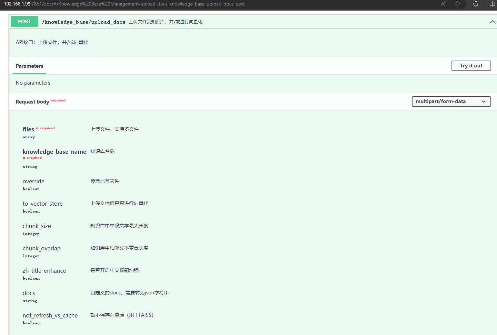

# LangChain-Chatchat Upload

LangChain-Chatchat Upload 是一个用于上传和更新知识库数据的项目，旨在通过langchain-chatchat模型所给的api接口帮助管理和更新mongodb数据库文档到知识库的过程。该项目包含了以下几个主要的 Python 脚本：

- **list_files.py**: 查询知识库中的文件列表，方便验证是否有新的文件上传。
- **upload_init.py**: 将 MongoDB 数据库中的所有数据上传到知识库中。
- **upload.py**: 将更新的数据库数据上传到知识库。
- **upload_test.py**: 用本地文件测试能否正常上传知识库

## 使用方法

1. **查询知识库文件列表**

使用`list_files.py`查询知识库中的文件列表，验证新文件是否成功上传。

2.  **初次上传**

使用`upload_init.py`将 MongoDB 数据库中的所有数据初次上传到知识库。
```
def export_collection_to_json(collection_name, output_file):
    # 给数据库中的每个文档添加标签和时间戳，并导出为 JSON 文件
    collection = db[collection_name]
    cursor = collection.find() # 查找所有数据
```
3.  **日常更新**

使用`upload.py`将更新的数据库数据上传到知识库。
```
articles_to_scrape = int(result["更新列表项数"])
        print(f"更新列表项数: {articles_to_scrape}")

    # connection.close()  # 关闭数据库连接

    documents = collection.find().sort([('_id', -1)]).limit(articles_to_scrape)
```
读取mysql数据库中 **jsonlist_count** 存储的更新列表项数articles_to_scrape，查询数据库里更新的数据，打包到 **xxqg_output.json** 文件并上传到知识库，更新知识库上传日志

4. **本地文件测试**

使用`upload_test.py`测试能否将本地文件上传知识库。


